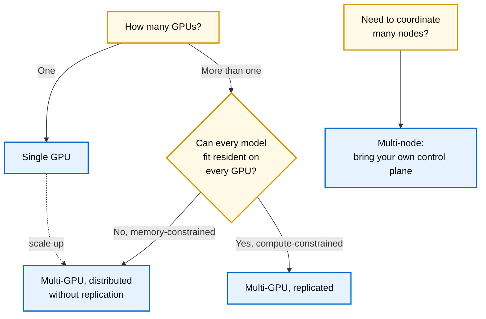
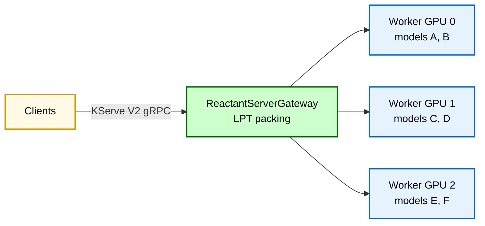
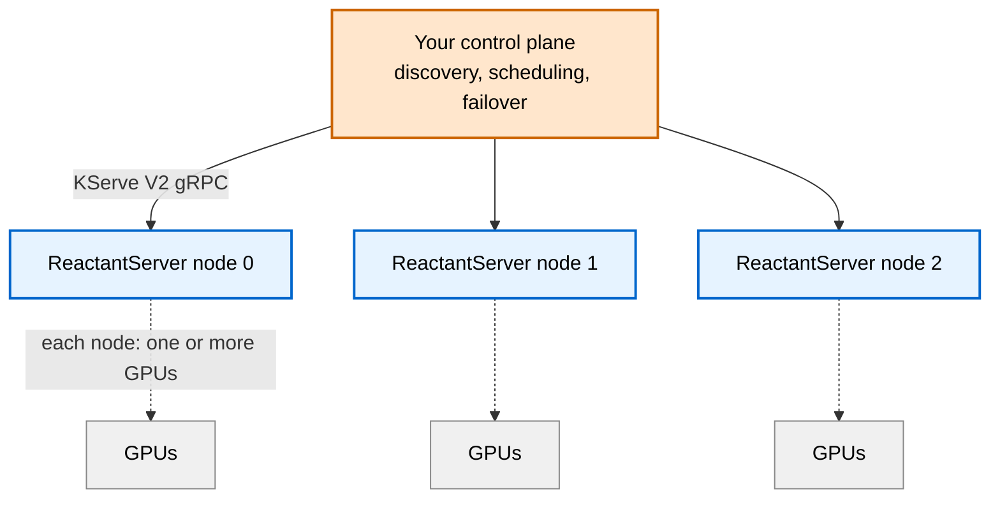

# Common Use Cases

This page describes the most common ways people deploy ReactantServer, organized by the situation you are in rather than by feature. Each section describes who the configuration is for, what it provides today, and gives an example configuration to start from.

Support for more accelerators is planned. CUDA is supported today, with CPU for development and fallback. For the authoritative and current feature details, see the [Architecture](../design/architecture.md) and the manual pages linked throughout; this page is a guide to choosing a configuration, not a substitute for the reference documentation.

## Choosing a configuration

The decision comes down to how many GPUs you have and, if more than one, whether your constraint is memory or compute.



| Situation | Configuration | Optimizes for |
|---|---|---|
| One GPU, many models | Single GPU | Fitting many models on limited hardware |
| Several GPUs, models do not all fit everywhere | Multi-GPU distributed | Serving more models than any one GPU holds |
| Several GPUs, models fit everywhere, need throughput | Multi-GPU replicated | Spreading compute load across replicas |
| Many machines | Multi-node | Whatever your control plane decides |

## Single GPU

**Who it is for.** A small lab that has trained many models and wants to serve them all on one GPU without worrying about whether they fit in VRAM at once.

**What it provides today.**

- On-demand model loading (weights stay resident in host RAM, stream onto the GPU on demand, evicted LRU under a byte budget)
- Batch coalescing
- FIFO and fair (deficit-weighted, cost-aware) scheduling options
- Add, remove, and update models without restarting the server

On-demand loading is what makes this work for "a ton of models": a card serves far more models than fit in VRAM at once, paying a single host-to-device transfer on a cold call. Fair scheduling ensures that frequently called models do not starve infrequently called ones. Together they give a balanced experience where you can serve a large model library on modest hardware and trust that every model gets served.

This is the recommended starting point for small labs. It is also the conceptual foundation for the multi-GPU distributed case, which scales this same idea across cards.

**Example configuration.** A node file with a single worker on the visible GPU. The on-demand
weight cache (`weight_cache_bytes`) lets the model library exceed VRAM: weights load lazily and
evict LRU within the budget. The `fair` discipline shares GPU time across models so a busy model
does not starve the rest. Mount it over `/etc/reactantserver/node.yaml`.

```yaml
# node.yaml — one GPU, many models served on demand.
model_repo: /var/lib/reactantserver/models
base_port: 8080
metrics_base_port: 9100
gpus: auto                          # one worker on the visible GPU

global:
  cache_dir: /var/cache/reactantserver
  runtime:
    backend: cuda
    mem_fraction: 0.9
    # Weights load lazily and evict LRU within this GPU byte budget (here 24 GiB), so the model
    # library need not fit in VRAM at once. 0 keeps every weight resident.
    weight_cache_bytes: 25769803776
  scheduler:
    discipline: fair                # cost-aware share of GPU time across models (the default)
    ema_halflife_seconds: 30.0
    max_queue_depth: 1024
  endpoints:
    host: 0.0.0.0
```

See [Node Configuration](node_config.md) and [On-demand Weights](on_demand_weights.md) for the full surface.

## Multi-GPU, distributed without replication

**Who it is for.** A lab that has outgrown one GPU. You have several cards, but your model library is large enough that you cannot fit every model on every GPU. Your constraint is memory: there is not enough VRAM to replicate everything.

**What it provides today.**

- On-demand model loading (per GPU, as in the single-GPU case)
- ReactantServerGateway LPT packing with batch coalescing
- Add, remove, and update models without restarting the server

You can think of this as seamlessly scaling up the single-GPU case. The gateway uses LPT (longest-processing-time) packing to distribute models across GPUs, balancing memory footprint against compute load. It does not provide the same guarantees as the single-GPU fair scheduler, but the way LPT packing distributes models implicitly avoids the situation where infrequently called models are completely starved by frequently called ones: spreading models across cards by their load keeps any one card from being monopolized.



**Example configuration.** A node file with one worker per GPU, and the embedded gateway in
`lpt_packing` mode with `default_replicas: 1` so each model lives on a single GPU that the packer
chooses by balancing memory and compute. `lpt_packing` requires the workers to run the `fifo`
discipline (placement moves to the gateway).

```yaml
# node.yaml — several GPUs on one machine; each model placed on one GPU by the gateway.
model_repo: /var/lib/reactantserver/models
base_port: 8080
metrics_base_port: 9100
gpus: auto                          # one worker per visible GPU

global:
  cache_dir: /var/cache/reactantserver
  runtime:
    backend: cuda
    mem_fraction: 0.9
    weight_cache_bytes: 25769803776 # on-demand cache per GPU, as in the single-GPU case
  scheduler:
    discipline: fifo                # required by lpt_packing (placement moves to the gateway)
    ema_halflife_seconds: 30.0
    max_queue_depth: 1024
  endpoints:
    host: 0.0.0.0
```

The supervisor runs the embedded gateway for you; enable `lpt_packing` on it either with
`REACTANT_GATEWAY_SCHEDULING_MODE=lpt_packing` (plus matching `REACTANT_GATEWAY_SCHEDULING_*`
variables) or by mounting a `gateway.yml` with:

```yaml
# gateway.yml — embedded gateway scheduling block.
scheduling:
  mode: lpt_packing
  default_replicas: 1               # each model on a single GPU; the packer balances which one
  rebalance_compute_seconds: 30     # repack after the fleet consumes this many GPU-seconds
```

See [Multi-GPU Gateway](multi_gpu_gateway.md) and [Scaling to Multiple GPUs](scaling.md).

## Multi-GPU, replicated

**Who it is for.** You have several GPUs and enough memory that your models fit on more than one card. Your constraint is compute, not memory: you want to spread a model's request load across replicas for throughput.

**What it provides today.**

- ReactantServerGateway `lpt_packing` with a configurable replica count per model and coalescing-aware routing across those replicas
- The simpler `round_robin` and `least_outstanding` modes, which also distribute a model's requests across its replicas when you do not need batch coalescing or reactive placement

**Which scheduling mode.** All three modes work with replicas, so the choice is about what you optimize. Use `lpt_packing` when you want to maximize batch coalescing even with replicas: it concentrates a model's requests to fill one replica's batch before spilling to the next, and it places models on GPUs reactively by measured compute and memory load, including which GPUs host a replicated model. If you do not need reactive model placement (beyond the simple, request-level reactivity that `least_outstanding` itself provides) or batch coalescing, `round_robin` and `least_outstanding` are both significantly less complicated and need no measurements, no `fifo` discipline, and no startup preconditions. Both route across the replicas the workers already serve, so you replicate a model by loading it on more than one worker rather than by setting a gateway replica count: `round_robin` spreads requests blindly across those replicas, and `least_outstanding` spreads them by live occupancy, sending each request to the replica with the fewest in flight.

**How to configure it.** For the batching-first path, set `scheduling.mode: lpt_packing` in `gateway.yml` and give the replicated model a replica count, either with `scheduling.default_replicas` or per model under `scheduling.models.<name>.replicas`. The gateway places each model on that many distinct GPUs and routes its requests to fill one replica's batch before moving to the next, so coalescing is preserved across replicas rather than diluted. Tune `routing_fill_factor` (raise it above 1.0 to keep the next batch queued under fast arrival) and choose a `routing_policy`: `fill_rr` (default) round-robins which replica opens each batch, and `fill_least` opens it on the least compute-loaded GPU (best when replicas share GPUs with other models). For the simpler path, set `scheduling.mode: round_robin` or `least_outstanding` and load the model on each worker that should serve it; neither mode takes a replica count or any of the `lpt_packing` knobs. See [Multi-GPU Gateway](multi_gpu_gateway.md) for the full set of knobs.

Replica counts are fixed at startup; a model does not fan out automatically under load. Size the replica count for the model's expected concurrency, and rely on the per-GPU queue and batch coalescing to absorb bursts on each replica.

**Example configuration.** The node file is the same as the distributed case (one worker per GPU,
`discipline: fifo`). The difference is in the gateway: give the hot model a replica count so it is
placed on more than one GPU, and the gateway routes its requests to fill one replica's batch before
the next.

```yaml
# gateway.yml — front the node's workers and replicate hot models for throughput.
scheduling:
  mode: lpt_packing
  default_replicas: 1               # most models on one GPU
  rebalance_compute_seconds: 30
  routing_fill_factor: 1.0          # raise above 1 to keep the next batch queued under bursty load
  routing_policy: fill_rr           # fill_least when replicas share GPUs with other models
  models:
    resnet50:
      replicas: 2                   # served on 2 distinct GPUs; requests routed to fill batches
```

To replicate every model across all GPUs without listing each one, set `default_replicas: all`
(it resolves to the current ready-worker count and tracks the fleet as workers come and go):

```yaml
scheduling:
  mode: lpt_packing
  default_replicas: all             # every model on every GPU
```

Replica counts are fixed at startup; size them for the model's expected concurrency.

!!! warning "Make sure you have the memory to replicate"
    Replicating a model puts its full weight footprint on every GPU it lands on. It is your
    responsibility to keep the result feasible: if the models placed on a GPU do not fit in its
    weight budget, that worker thrashes, loading and evicting weights on nearly every request and
    collapsing throughput. This is the failure mode to watch for with `default_replicas: all` on a
    memory-constrained fleet. Size replica counts against your GPU memory, and watch the gateway's
    oversubscription warning (see [Multi-GPU Gateway](multi_gpu_gateway.md)).

See [Multi-GPU Gateway](multi_gpu_gateway.md).

## Multi-node (bring your own control plane)

**Who it is for.** You are coordinating many machines, beyond what a single node supervisor handles. At this scale you typically have specific requirements (your own service discovery, scheduling policy, failover, traffic management) that a general-purpose control plane would not satisfy well.

**What the project provides.** A KServe V2 gRPC control plane service endpoint. The project deliberately does not ship a multi-node control plane of its own. The reasoning: anyone who needs multi-node coordination is usually at a scale where they would build a control plane tailored to their exact requirements, so a generic one would not fit. Instead, the project provides the interface a control plane integrates against, so you can build or adapt your own coordination layer on top of ReactantServer nodes.



**The endpoint contract.** Each node exposes the same interface a control plane integrates
against: the KServe V2 gRPC data plane (`ModelInfer`, `RepositoryIndex`, `ServerReady`) plus the
worker control RPCs (`ModelControlStatus`, `SetModelResidency`, `SetModelPolicy` for residency and
policy, `CompactMemory` to defragment device memory), and an admin HTTP port serving `/healthz`,
`/readyz`, and Prometheus `/metrics`. Your
control plane discovers which models each node serves via `RepositoryIndex` and routes `ModelInfer`
to a node that reports the model ready.

**Example integration.** The simplest multi-node setup reuses the standalone gateway, pointed at
every node's worker endpoints; a larger deployment replaces it with your own control plane speaking
the same gRPC interface.

```yaml
# gateway.yml — a standalone gateway fronting the workers of several nodes.
listen:
  grpc: "0.0.0.0:8001"
  metrics: "0.0.0.0:8002"
scheduling:
  mode: lpt_packing
  default_replicas: 1
endpoints:
  - "node1-worker0:8080"
  - "node1-worker1:8081"
  - "node2-worker0:8080"
  - "node2-worker1:8081"
# Optional: aggregate every worker's /metrics behind the gateway's own.
# metrics_endpoints:
#   - "node1-worker0:9100"
#   - "node1-worker1:9101"
#   - "node2-worker0:9100"
#   - "node2-worker1:9101"
```

See [Multi-GPU Gateway](multi_gpu_gateway.md) and [Docker Deployment](docker.md) for the node interface, ports, and health/metrics endpoints a control plane would use.

## Summary

The common path is to start on a single GPU with on-demand loading and fair scheduling, then scale to multi-GPU distributed (LPT packing) as the model library outgrows one card. Replicated multi-GPU is for compute-bound workloads: set a per-model replica count under `lpt_packing` and the gateway routes across replicas to preserve batch coalescing. Multi-node is for users who bring their own control plane and integrate against the provided gRPC interface.

Feature support evolves; check the linked manual and design pages for the current state rather than relying on this overview alone.
