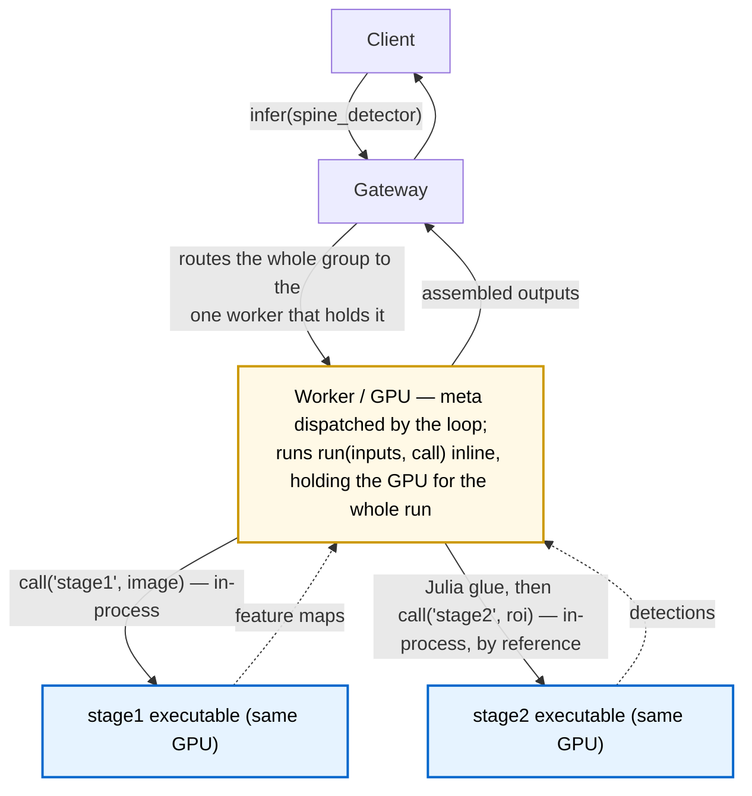

```@meta
CurrentModule = ReactantServer
```

# Meta Models

A meta model is a bundle whose `model.jl` orchestrates *other* models with ordinary Julia in
between, rather than wrapping a single compiled executable. It exists for the logic `torch.export`
cannot trace: data-dependent control flow, loops whose bounds depend on a tensor's contents, or a
pipeline where stage two's inputs are computed from stage one's outputs. The server runs the
orchestration as a normal inference request, so a meta model is addressable by clients under its
own name exactly like any other model.

If your model is a single traced graph, use a plain bundle with optional pre/post hooks (see
[Bundles & model.jl](bundles.md)). Reach for a meta model only when the glue between sub-models
is real program logic.

## Anatomy

A meta bundle is a directory with a `manifest.yaml` and a `model.jl`, and no compiled artifact or
weights of its own. The manifest declares `kind: meta`, lists the models the orchestration is
allowed to call, and must carry `client_inputs`/`client_outputs` (there is no executable to infer
the client-facing I/O from):

```yaml
format_version: "2.0"
name: spine_detector
kind: meta
meta:
  calls: [spine_detector_stage1, spine_detector_stage2]
client_inputs:
  - {name: IMAGE, dtype: f32, shape: chw, dims: {c: 3, h: 1024, w: 1024}}
client_outputs:
  - {name: BOXES, dtype: f32, shape: nb, dims: {b: 4}}
```

The `model.jl` calls [`register_meta_model`](@ref) with the orchestration function:

```julia
register_meta_model("spine_detector"; run = function (inputs, call)
    feats = call("spine_detector_stage1", inputs)            # backbone
    rois  = compute_rois(feats)                              # ordinary Julia, data-dependent
    out   = call("spine_detector_stage2", rois)              # head
    return [ReactantServer.NamedTensor("BOXES", out[1].data)]
end)
```

`run` has the form `run(inputs::Vector{NamedTensor}, call) -> Vector{NamedTensor}`. The injected
`call(model_name, inputs)` invokes another model and returns its outputs as
[`NamedTensor`](@ref)s. The callee must appear in `meta.calls`; calling an undeclared model is a
loud error. The loader also rejects a meta bundle whose `model.jl` calls `register_model` instead
of `register_meta_model`.

## Execution: a scheduled, local unit

A meta is a scheduled unit, the same as a regular model. When the worker's dispatch loop selects it,
the loop runs the whole `run(inputs, call)` orchestration inline, and `call` invokes each sub-model's
compiled executable directly, in the same process. There is no gateway round-trip and no
serialization between stages: a sub-call is a local invocation of the sub-model's executable, and a
tensor handed from one stage to the next is passed by reference. The same `model.jl` runs unchanged
on a single worker or in a fleet; the author never writes routing and never needs to know where
anything is placed, because a meta only ever runs where its sub-models already live (see Placement,
below).



## How it interacts with batch scheduling

Because the dispatch loop runs one execution at a time, the meta holds the GPU exclusively for its
entire run, including the Julia glue between stages. That is the deliberate trade. The stages run
back to back with no queue hops, but a stage runs at batch 1 per meta rather than being coalesced
with other clients' calls to the same model, so the design gives up some batching throughput in
exchange for removing the multi-hop latency and queue contention that routing each sub-call
separately would incur. While a meta runs, no other model dispatches and no control command is
processed on that worker until it returns; because the transport is gone, a meta's wall time is now
close to the sum of its stages' compute, so that exclusive hold is short.

A meta carries a deadline like any request: it is dropped at admission if already expired, and the
orchestration bails (raising `DeadlineExceeded`) before issuing a further sub-call once the budget is
gone, so an abandoned request stops consuming GPU at the next stage boundary rather than running its
whole pipeline. Under the `edf` discipline a meta with a sooner deadline is dispatched ahead of work
with more budget left (see the discipline notes in [Node Configuration](node_config.md)).

## Placement: the group travels together

A meta owns no weights or executable of its own, so it is not placed on a GPU by itself. Instead the
meta and the sub-models it calls form a group that the gateway places as a single unit. The worker
reports the meta to the gateway with a memory footprint equal to the sum of its sub-models' weights
and hides the sub-models from discovery, so the gateway packs and routes the group by the meta's own
traffic and never sees the individual stages. When the group is placed on a GPU, the sub-models'
weights are kept resident there together, so the meta's in-process sub-calls always find their
executables and weights local.

This is the inverse of routing each sub-call independently. The author still writes the orchestration
with no knowledge of placement, but the cost of that abstraction is now paid once, at placement time
(the group is co-located), rather than per sub-call at request time (a hop to wherever each stage
happened to land). The sub-models are internal to the meta: they are never addressable by clients and
never appear in the gateway's routing table.

## Reuse buffers with `call.scratch`

A meta's data-dependent glue often builds a large intermediate, for example a ~50 MB ROI feature
tensor handed from one stage to the next. Allocating that fresh on every request drives GC pressure.
The injected `call` exposes a reuse-buffer allocator for this case:

```julia
roi = call.scratch((7, 7, 256, k), Float32)   # from the worker's reuse pool (or a plain array)
fill_rois!(roi, feats, boxes)                  # write directly into it
out = call("spine_detector_stage2", [ReactantServer.NamedTensor("ROI_FEATS", roi)])
```

The pool is plain memory, local to the worker, and never shared across processes. It exists purely to
keep large intermediates off the per-request allocation path; because the sub-call runs in-process,
the buffer is handed to the next stage by reference, with no copy. A meta that never calls `scratch`
just allocates normally, and the same `model.jl` is correct with or without a pool configured.
Because metas run one at a time, the pool sees no contention.

Request every buffer in one `call.scratch` call (pass a vector of `dims => T` pairs to get several at
once); calling it more than once per request is rejected, and a scratch buffer must reach the
sub-call as a contiguous array (a reshape or contiguous prefix is fine).

## Constraints

- **A meta model may not call another meta model.** This is validated at load: a group is exactly
  one level deep.
- **Compute-only metas are allowed.** A meta may declare an empty `meta.calls` and do all its work
  in Julia, calling no sub-models at all. This is useful for logic that is awkward to express as a
  traced graph but needs no separate executable.
- **Sub-models are internal.** A model named in some meta's `meta.calls` is reachable only through
  that meta, never addressed by clients directly, and is hidden from the gateway's discovery and
  placement; the meta's group carries it.

## See also

- [Bundles & model.jl](bundles.md) for the plain (non-meta) bundle path and pre/post hooks
- [Multi-GPU Gateway](multi_gpu_gateway.md) for how the gateway routes and places models
- [Node Configuration](node_config.md) for the scheduling disciplines, including `edf`
- [`register_meta_model`](@ref) in the API reference
