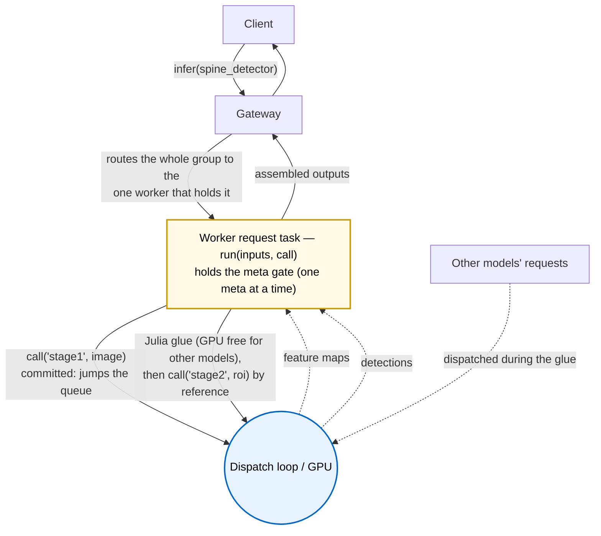

```@meta
CurrentModule = ReactantServer
```

# Meta Models

A meta model is a bundle whose `model.jl` orchestrates *other* models with ordinary Julia in
between, rather than wrapping a single compiled executable. It exists for the logic `torch.export`
cannot trace: data-dependent control flow, loops whose bounds depend on a tensor's contents, or a
pipeline where stage two's inputs are computed from stage one's outputs. The server runs the
orchestration as a normal inference request, so a meta model is addressable by clients under its
own name exactly like any other model.

If your model is a single traced graph, use a plain bundle with optional pre/post hooks (see
[Bundles & model.jl](bundles.md)). Reach for a meta model only when the glue between sub-models
is real program logic.

## Anatomy

A meta bundle is a directory with a `manifest.yaml` and a `model.jl`, and no compiled artifact or
weights of its own. The manifest declares `kind: meta`, lists the models the orchestration is
allowed to call, and must carry `client_inputs`/`client_outputs` (there is no executable to infer
the client-facing I/O from):

```yaml
format_version: "2.0"
name: spine_detector
kind: meta
meta:
  calls: [spine_detector_stage1, spine_detector_stage2]
client_inputs:
  - {name: IMAGE, dtype: f32, shape: chw, dims: {c: 3, h: 1024, w: 1024}}
client_outputs:
  - {name: BOXES, dtype: f32, shape: nb, dims: {b: 4}}
```

The `model.jl` calls [`register_meta_model`](@ref) with the orchestration function:

```julia
register_meta_model("spine_detector"; run = function (inputs, call)
    feats = call("spine_detector_stage1", inputs)            # backbone
    rois  = compute_rois(feats)                              # ordinary Julia, data-dependent
    out   = call("spine_detector_stage2", rois)              # head
    return [ReactantServer.NamedTensor("BOXES", out[1].data)]
end)
```

`run` has the form `run(inputs::Vector{NamedTensor}, call) -> Vector{NamedTensor}`. The injected
`call(model_name, inputs)` invokes another model and returns its outputs as
[`NamedTensor`](@ref)s. The callee must appear in `meta.calls`; calling an undeclared model is a
loud error. The loader also rejects a meta bundle whose `model.jl` calls `register_model` instead
of `register_meta_model`.

## Execution: local, on the request task, one meta at a time

A meta's `run(inputs, call)` executes on the gRPC request task, off the GPU dispatch loop, exactly
like a model's pre/post hooks. Each `call(name, inputs)` re-enters the local scheduler in-process:
the sub-model is dispatched on the loop and its result handed back to the orchestration. There is no
gateway round-trip and no serialization between stages; a tensor handed from one stage to the next is
passed by reference. The same `model.jl` runs unchanged on a single worker or in a fleet; the author
never writes routing and never needs to know where anything is placed, because a meta only ever runs
where its sub-models already live (see Placement, below).

Two rules shape how a meta shares the GPU with everything else on the worker:

- **One GPU meta at a time (by default).** A per-worker gate admits `REACTANT_META_CONCURRENCY` meta
  orchestrations at once, default **1**. A meta holds its permit across the whole run, including the CPU
  glue between stages, but it does **not** hold the GPU during that glue. While a meta computes between
  stages, the dispatch loop is free and serves other models, so the GPU is not idle during the glue. At
  the default of 1 the in-flight meta sprints to completion before the next starts, which is the most
  predictable behavior; raising the count lets metas overlap (one's glue hides behind another's GPU
  stage) for more meta throughput, at the cost of less predictable line-cutting and a scratch pool that
  must be sized for that many concurrent metas. A **compute-only** meta (empty `calls`, below) issues no
  sub-calls and bypasses the gate entirely, so a heavy pure-Julia meta never holds a permit a GPU meta needs.
- **In-flight sub-calls jump the line.** Once a meta holds the gate, each of its GPU stages is
  dispatched ahead of the queued regular work rather than waiting behind it. The number that can cut the
  line is tied to the gate: each in-flight meta contributes at most one pending sub-call, so the
  committed set is bounded by `REACTANT_META_CONCURRENCY`. At the default of 1 exactly one meta cuts the
  line and the behavior is fully deterministic; raising the gate lets that many metas cut the line
  symmetrically (no contention for a single privileged slot), so the one knob sets both how many metas
  run and how many are prioritized, a single dial for how strongly to favor meta completion.



## How it interacts with batch scheduling

A meta no longer holds the GPU for its whole run. Each stage is an ordinary dispatch on the loop, so
the GPU is occupied only while a stage actually computes and is free during the meta's CPU glue, when
the loop serves other models. The trade is the gate: while a meta holds its permit, a second meta on
the same worker waits (its stages cannot start), though the GPU is not wasted because regular models
run in the meantime. A stage runs at batch 1 for the meta unless other clients' calls to the same
sub-model happen to coalesce with it on the loop.

A meta carries a deadline like any request. It is dropped before it starts if the deadline has
already passed or if it cannot take a gate permit in time, so a meta backlog sheds at admission rather
than piling up, and no GPU is spent on a meta that will not run. Once a meta is in flight, its
continuation sub-calls are **committed**: they skip the predictive laxity drop, so a stage is never
shed merely because it might run long after earlier stages already consumed GPU. They still honor the
base check, so a meta whose deadline genuinely elapses mid-pipeline stops at the next stage boundary
(raising `DeadlineExceeded`) instead of running the rest. The net effect is that a meta either runs to
completion or is shed at a clean boundary, never silently discarding a stage it already paid for.
Under the `edf` discipline the committed sub-call inherits the meta's deadline, so it is ordered ahead
of fresher work (see the discipline notes in [Node Configuration](node_config.md)).

## Placement: the group travels together

A meta owns no weights or executable of its own, so it is not placed on a GPU by itself. Instead the
meta and the sub-models it calls form a group that the gateway places as a single unit. The worker
reports the meta to the gateway with a memory footprint equal to the sum of its sub-models' weights
and hides the sub-models from discovery, so the gateway packs and routes the group by the meta's own
traffic and never sees the individual stages. When the group is placed on a GPU, the sub-models'
weights are kept resident there together, so the meta's in-process sub-calls always find their
executables and weights local.

This is the inverse of routing each sub-call independently. The author still writes the orchestration
with no knowledge of placement, but the cost of that abstraction is now paid once, at placement time
(the group is co-located), rather than per sub-call at request time (a hop to wherever each stage
happened to land). The sub-models are internal to the meta: they are never addressable by clients and
never appear in the gateway's routing table.

## Reuse buffers with `call.scratch`

A meta's data-dependent glue often builds a large intermediate, for example a ~50 MB ROI feature
tensor handed from one stage to the next. Allocating that fresh on every request drives GC pressure.
The injected `call` exposes a reuse-buffer allocator for this case:

```julia
roi = call.scratch((7, 7, 256, k), Float32)   # from the worker's reuse pool (or a plain array)
fill_rois!(roi, feats, boxes)                  # write directly into it
out = call("spine_detector_stage2", [ReactantServer.NamedTensor("ROI_FEATS", roi)])
```

The pool is plain memory, local to the worker, and never shared across processes. It exists purely to
keep large intermediates off the per-request allocation path; because the sub-call runs in-process,
the buffer is handed to the next stage by reference, with no copy. A meta that never calls `scratch`
just allocates normally, and the same `model.jl` is correct with or without a pool configured.

Request every buffer in one `call.scratch` call (pass a vector of `dims => T` pairs to get several at
once); calling it more than once per request is rejected, and a scratch buffer must reach the
sub-call as a contiguous array (a reshape or contiguous prefix is fine). Concurrent metas (up to
`REACTANT_META_CONCURRENCY` gated metas, plus any compute-only metas) share the pool, so size it for
that many in-flight metas; the deadline-bounded acquire degrades gracefully if it is ever starved.

## Constraints

- **A meta model may not call another meta model.** This is validated at load: a group is exactly
  one level deep.
- **Compute-only metas are allowed.** A meta may declare an empty `meta.calls` and do all its work
  in Julia, calling no sub-models at all. This is useful for logic that is awkward to express as a
  traced graph but needs no separate executable. A compute-only meta issues no GPU sub-calls, so it
  bypasses the meta gate and runs on its request task without taking a permit.
- **Sub-models are internal.** A model named in some meta's `meta.calls` is reachable only through
  that meta, never addressed by clients directly, and is hidden from the gateway's discovery and
  placement; the meta's group carries it.

## See also

- [Bundles & model.jl](bundles.md) for the plain (non-meta) bundle path and pre/post hooks
- [Multi-GPU Gateway](multi_gpu_gateway.md) for how the gateway routes and places models
- [Node Configuration](node_config.md) for the scheduling disciplines, including `edf`
- [`register_meta_model`](@ref) in the API reference
